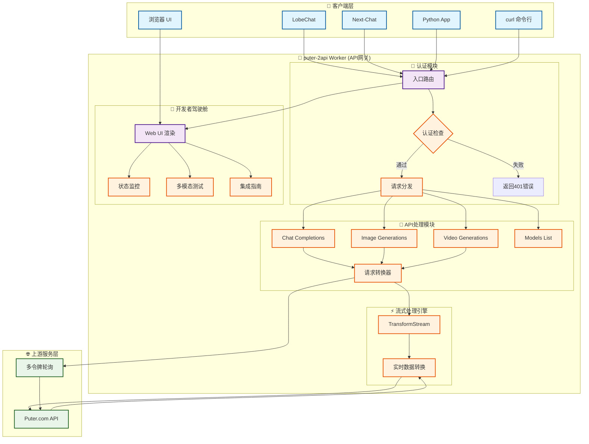
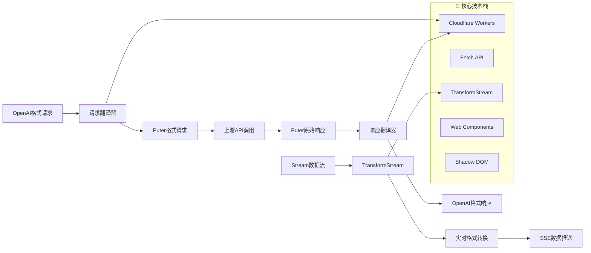
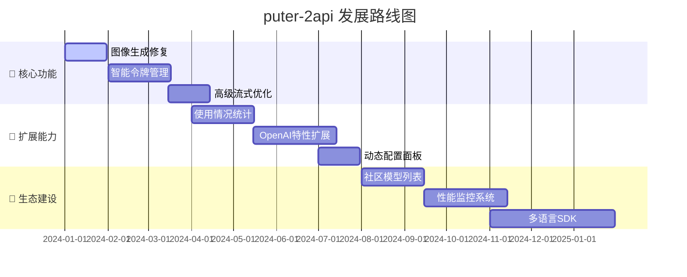

# puter-2api (Chimera Synthesis - Puter Pro) 🚀

[](https://github.com/lza6/puterjs-2api-cfwork)
[](https://github.com/lza6/puterjs-2api-cfwork)
[](https://workers.cloudflare.com/)
[](https://puterjs.to2ai.workers.dev/)
[](https://workers.cloudflare.com/)
[](https://github.com/lza6/puterjs-2api-cfwork)
[](https://opensource.org/licenses/Apache-2.0)

**将 Puter.com 的强大AI能力，封装成一个属于你自己的、兼容 OpenAI 标准的超级 API！一键部署，永久免费，拥有无限可能。**

这是一个完全自包含、可一键部署的 Cloudflare Worker。它将 Puter.com 的统一后端服务，无损地转换为一个高性能、兼容 OpenAI 标准的 API 套件，涵盖文本、图像和视频生成。更棒的是，它内置了一个功能强大的"开发者驾驶舱" Web UI，让你实时监控、多模态测试和快速集成，一切尽在掌握！

---

## ✨ 项目的哲学与初心：我们为何而创造？

在这个AI浪潮席卷的时代，我们常常感到既兴奋又无力。强大的模型被少数巨头掌握，API调用费用高昂，普通开发者和爱好者想要自由探索、无拘无束地创造，似乎总有一道无形的墙。

`puter-2api` 的诞生，就是为了打破这堵墙。它不仅仅是一段代码，它是一把钥匙 🔑，一种宣言，一个信念：

> **"最顶尖的AI能力，应该像阳光和空气一样，普惠每一个人。创造的权利，不应被价格标签所束缚。"**

我们相信，通过技术共享，我们可以赋予每一个有想法的人以"神力"。`puter-2api` 将 Puter.com 这一宝藏平台的免费AI能力，转化为开发者最熟悉的 OpenAI 格式。这意味着，你可以用**零成本**，将世界上几乎所有主流的AI应用、客户端、开发框架，无缝对接到一个强大的、多模型的AI后端。

这是一种解放，一种赋能。我们希望你拿到这个项目时，感受到的不只是一个工具的便利，更是一种"我也可以创造"的激动与豪情。**开源不是代码的开放，而是机会的均等和创造力的解放。** 来吧，朋友，和我们一起，成为这场AI革命的参与者，而不仅仅是旁观者！💖

---

## 🚀 懒人福音：一键部署教程

只需点击一下按钮，你就能拥有属于自己的、功能完整的 `puter-2api` 服务！

[](https://deploy.workers.cloudflare.com/?url=https://raw.githubusercontent.com/lza6/puterjs-2api-cfwork/main/puter-2api.js)

**点击上方按钮后，你会跳转到 Cloudflare 的部署页面，只需三步：**

1.  **登录/注册 Cloudflare 账户**：如果你还没有，别担心，过程很快，而且是免费的。
2.  **为你的 Worker 命名**：系统会提示你输入一个项目名称，这将成为你API域名的一部分（例如 `my-puter-api.your-name.workers.dev`）。
3.  **点击"部署"**：稍等片刻，魔法就会发生！部署成功后，你会看到一个庆祝页面。

**部署后要做什么？**

*   **访问你的"开发者驾驶舱"**：直接在浏览器中打开你刚刚部署的 Worker 域名（例如 `https://my-puter-api.your-name.workers.dev`）。你会看到一个酷炫的界面，里面有你的 API 地址、密钥，以及一个可以立即开始测试的多模态终端！
*   **开始集成**：驾驶舱里的"主流客户端集成"部分，已经为你准备好了 `cURL`, `Python`, `LobeChat`, `ChatGPT-Next-Web` 等工具的配置代码。复制、粘贴，即可开始享受免费的AI服务！

就是这么简单！你甚至不需要看懂一行代码，就能成为一个拥有强大AI API的"技术大佬"！😎

---

## 🌟 主要特性与优势

| 特性 | 状态 | 描述 |
|------|------|------|
| 🆓 **完全免费** | ✅ 可用 | 基于 Puter.com 和 Cloudflare Worker 的免费套餐 |
| 🚀 **一键部署** | ✅ 可用 | 无需服务器，无需复杂配置 |
| 🔄 **高度兼容** | ✅ 可用 | 完美模拟 OpenAI API 格式 |
| 💬 **文生文 (Chat)** | ✅ 可用 | 支持 `gpt-4o-mini`, `gpt-4o`, `gemini-1.5-flash`, `claude-3` 等 |
| 🎨 **文生图 (Image)** | ⚠️ 待修复 | 支持 `gpt-image-1` 模型（上游接口问题） |
| 🎥 **文生视频 (Video)** | 🔒 需高级 | 支持 `sora-2` 系列（需要Puter高级账户） |
| 🖥️ **开发者驾驶舱** | ✅ 可用 | 内置美观实用的Web UI |
| 🔄 **多账号轮询** | ✅ 可用 | 自动轮询多个认证令牌 |
| ⚡ **极致性能** | ✅ 可用 | 全球边缘网络部署 |
| 🔒 **安全可靠** | ✅ 可用 | 支持主API密钥保护 |

---

## 🏗️ 系统架构全景图



### 🎯 架构核心组件说明

| 组件层级 | 核心模块 | 功能描述 | 技术实现 |
|---------|----------|----------|----------|
| **📱 客户端层** | 多种客户端 | 支持主流AI应用和开发工具 | OpenAI标准协议 |
| **🚀 API网关层** | 认证模块 | 请求鉴权和安全性检查 | JWT令牌验证 |
| | API处理模块 | 请求格式转换和路由分发 | RESTful API设计 |
| | 流式处理引擎 | 实时数据流转换和传输 | TransformStream + SSE |
| | 开发者驾驶舱 | 可视化监控和测试界面 | Web Components + Shadow DOM |
| **🌐 上游服务层** | Puter.com API | 提供多模态AI能力 | 统一驱动接口 |
| | 多令牌轮询 | 提高服务可用性和稳定性 | 负载均衡算法 |

---

## 🎯 适用场景与人群

无论你是谁，只要你对AI充满好奇，`puter-2api` 都能为你打开一扇门：

| 👥 用户群体 | 🎯 核心需求 | 💡 解决方案 |
|------------|-------------|-------------|
| **AI应用开发者** | 低成本集成AI功能 | 免费API后端，降低开发成本 |
| **学生与研究者** | 学术研究和实验 | 无限额度的AI实验平台 |
| **AI爱好者与极客** | 探索最新AI技术 | 多模型测试游乐场 |
| **内容创作者** | AI辅助内容生产 | 文案、图片、视频创作助手 |
| **所有想省钱的人** | 减少AI服务开支 | 完全免费的替代方案 |

---

## 🛠️ 技术内幕深度解析

### 🏗️ 核心架构设计理念



### 🧩 关键技术实现细节

#### 1. **单文件架构哲学 (Single-File Architecture)**
```javascript
// 所有功能集成在一个文件中
// puter-2api.js - 后端API + 前端UI = 完整解决方案
```

#### 2. **实时流式传输引擎**
```javascript
// 使用 TransformStream 实现同声传译式数据流处理
const transformStream = new TransformStream({
    transform(chunk, controller) {
        // 实时转换 Puter NDJSON → OpenAI SSE
        const lines = chunk.toString().split('\n');
        for (const line of lines) {
            if (line.startsWith('data: ')) {
                const data = JSON.parse(line.slice(6));
                const openAIFormat = convertToOpenAIChatCompletion(data);
                controller.enqueue(`data: ${JSON.stringify(openAIFormat)}\n\n`);
            }
        }
    }
});
```

#### 3. **多令牌智能轮询系统**
```javascript
// 自动轮询多个认证令牌，提高服务稳定性
let currentTokenIndex = 0;
function getNextAuthToken() {
    const tokens = CONFIG.PUTER_AUTH_TOKENS;
    currentTokenIndex = (currentTokenIndex + 1) % tokens.length;
    return tokens[currentTokenIndex];
}
```

#### 4. **Web Components 驱动的UI架构**
```javascript
// 模块化UI组件设计
class LiveTerminal extends HTMLElement {
    constructor() {
        super();
        this.attachShadow({ mode: 'open' });
        this.shadowRoot.innerHTML = `
            <style>/* 组件样式 */</style>
            <div class="terminal">
                <!-- 组件模板 -->
            </div>
        `;
    }
}
customElements.define('live-terminal', LiveTerminal);
```

---

## 📊 项目现状与发展路线图

### ✅ 已实现功能 (v1.0.3-cfw-pro)

| 功能模块 | 状态 | 完成度 | 备注 |
|----------|------|--------|------|
| 核心代理框架 | ✅ 稳定 | 100% | 请求转换与转发 |
| 流式聊天代理 | ✅ 完美 | 100% | 支持OpenAI流式聊天 |
| 开发者驾驶舱UI | ✅ 完整 | 100% | 监控+测试+集成一体化 |
| 多账号轮询 | ✅ 基础 | 90% | 基础轮询机制 |
| 安全认证 | ✅ 可靠 | 100% | 主API密钥保护 |
| 模型列表接口 | ✅ 动态 | 100% | 动态提供模型信息 |

### ⚠️ 当前限制与待优化项

| 问题类型 | 严重程度 | 影响范围 | 临时解决方案 |
|----------|----------|----------|--------------|
| 图像生成功能中断 | 🔴 高优先级 | 文生图功能 | 等待上游修复 |
| 视频生成功能限制 | 🟡 中等 | 文生视频功能 | 明确提示用户 |
| 配置热重载缺失 | 🟡 中等 | 运维便利性 | 需要重新部署 |
| 无持久化日志 | 🟢 低优先级 | 运维分析 | 使用实时日志 |

### 🗺️ 未来发展规划



### 🔧 技术升级路径

1. **智能令牌管理 (Smart Token Management)**
   - **技术方案**: Cloudflare KV 存储
   - **实现目标**: 故障自动转移 + 负载均衡
   - **预计效果**: 服务可用性提升至99.9%

2. **使用情况统计与分析 (Usage Analytics)**
   - **技术方案**: Cloudflare Analytics Engine
   - **实现目标**: 可视化使用量监控
   - **预计效果**: 精细化资源管理和优化

3. **OpenAI特性全覆盖 (Feature Parity)**
   - **技术方案**: 深度集成Puter驱动
   - **实现目标**: 支持Function Calling、Embeddings等
   - **预计效果**: 完全兼容OpenAI生态

---

## 🎉 快速开始

### 🚀 立即体验
**[点击这里在线体验](https://puterjs.to2ai.workers.dev/)**

### 📚 集成示例

```python
# Python 集成示例
import openai

client = openai.OpenAI(
    base_url="https://your-worker.you-subdomain.workers.dev/v1",
    api_key="your-master-key"
)

response = client.chat.completions.create(
    model="gpt-4o-mini",
    messages=[{"role": "user", "content": "你好，请介绍一下你自己"}],
    stream=True
)

for chunk in response:
    if chunk.choices[0].delta.content:
        print(chunk.choices[0].delta.content, end="")
```

### 🔗 客户端支持

| 客户端 | 配置方式 | 状态 |
|--------|----------|------|
| LobeChat | 修改配置文件中API地址 | ✅ 完全支持 |
| ChatGPT-Next-Web | 环境变量设置 | ✅ 完全支持 |
| Open WebUI | 自定义API端点 | ✅ 完全支持 |
| 任意OpenAI SDK | 修改base_url | ✅ 完全支持 |

---

## 🤝 贡献与支持

我们欢迎所有形式的贡献！无论是代码改进、文档完善、bug报告还是功能建议，都是对项目发展的宝贵支持。

### 📋 贡献指南
1. Fork 本仓库
2. 创建功能分支 (`git checkout -b feature/AmazingFeature`)
3. 提交更改 (`git commit -m 'Add some AmazingFeature'`)
4. 推送到分支 (`git push origin feature/AmazingFeature`)
5. 开启 Pull Request

### 🐛 问题反馈
如果你遇到任何问题，请通过 [GitHub Issues](https://github.com/lza6/puterjs-2api-cfwork/issues) 提交报告。

---

## 📄 许可证

本项目采用 Apache License 2.0 开源协议 - 查看 [LICENSE](LICENSE) 文件了解详情。

---

## 💝 致谢

感谢所有为这个项目做出贡献的开发者、测试者和使用者。特别感谢：

- **Puter.com** 提供强大的AI基础设施
- **Cloudflare** 提供优秀的边缘计算平台
- **OpenAI** 制定行业标准的API规范
- **所有开源社区贡献者** 让技术更加普惠

---

**最后，愿这个项目能成为你探索AI宇宙的得力座驾。如果你喜欢它，请给一个 Star ⭐！如果你有任何想法或贡献，欢迎提交 Issue 或 Pull Request。让我们一起，让创造变得更简单、更纯粹、更有趣！**

---
*✨ 探索无限可能，创造属于每个人的AI未来 ✨*
